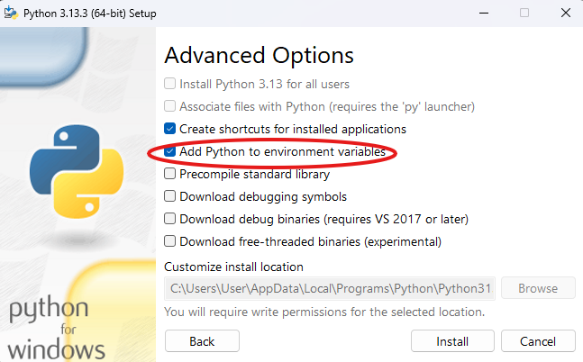
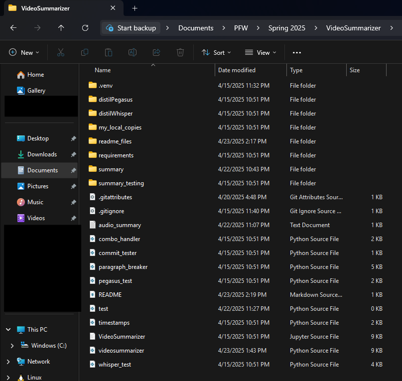
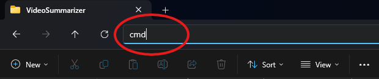
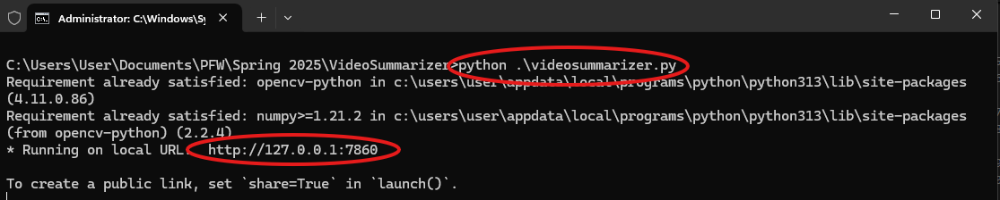
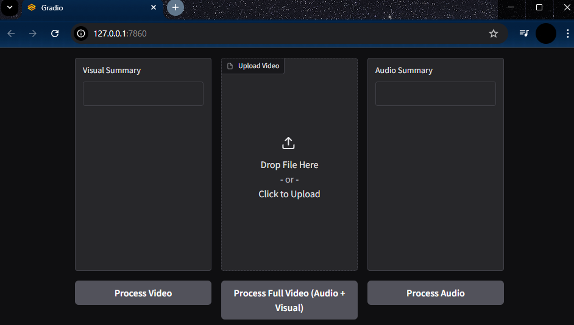
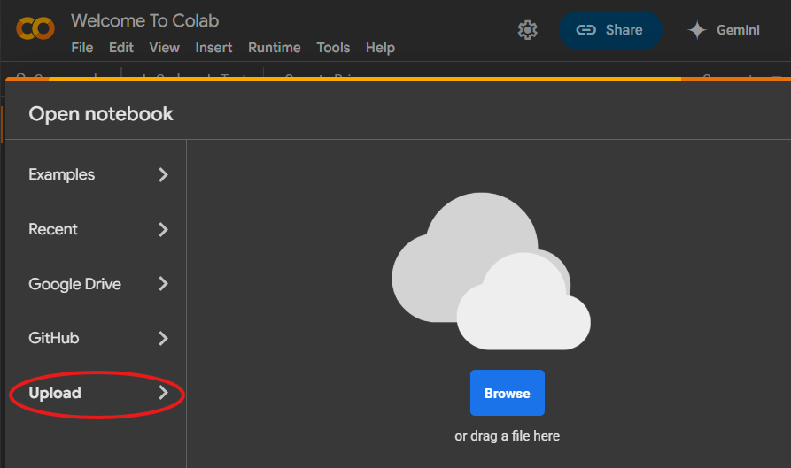
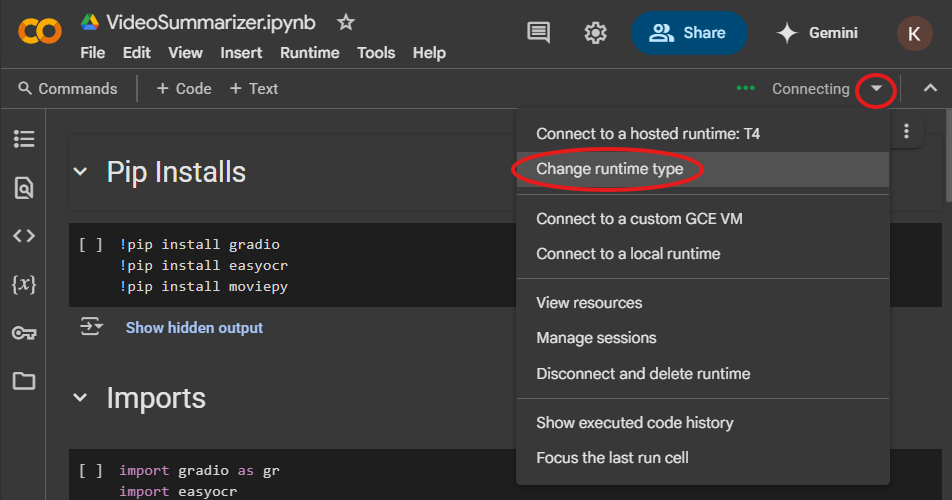
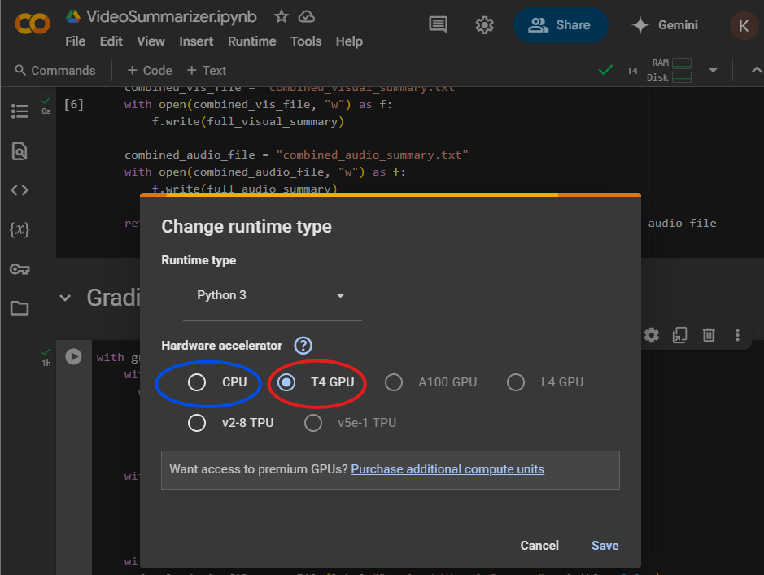
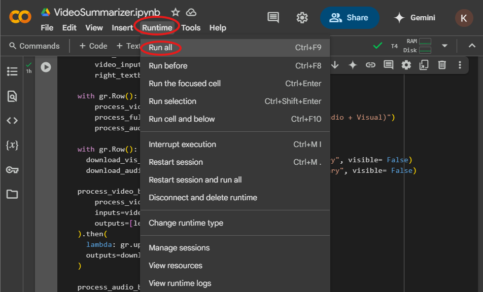
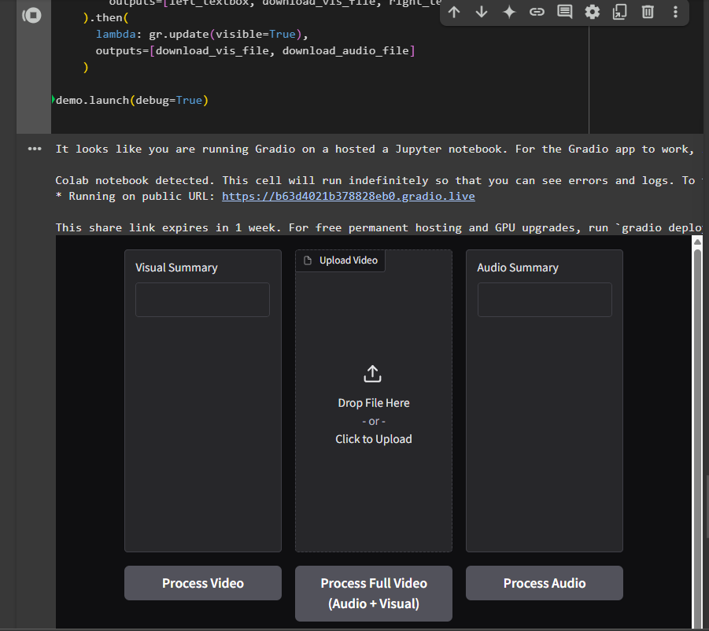

# VideoSummarizer
> [!NOTE]
> This current version only reads on screen text not human action for the visual summary 
# Setup
If you plan to use the Python file(.py) please just use the folder that this README.md is in.

If you plan to use the Jupiter Notebook please upload this folder to google drive and carefully follow the instructions.

# Python file(.py)
The python version of VideoSummarizer is 'safer' and arguably easier version, but it is slower.

It is safer as summary files by default are saved to your device in this folder.

It is slower because you probably are using a CPU and not a GPU.

## Download Python
If you do not have python on your device please download it. 
This link is to the official website https://www.python.org/downloads/

This project was made in python 3.13.3 so we would recomend that you download that version. 

> [!IMPORTANT]
>  When installing please check the box that says "Add Python to environment variables".


# Running videosummarizer.py
Once python is downloaded we can now run our project. 

> [!IMPORTANT]
>The following steps are for Windows users.

Please navigate to where you have this folder saved and open it so you see something like this.



Once there at the top please type cmd and hit enter.



After hitting enter you will bring up this screen. Please enter this command "python .\videosummarizer.py"(first red circle).



After running that command it will install some python packages that our code needs. Dont worry to much about this we just need to look for the http:// link that is made(second red circle). please click that link and youll be brought to the VideoSummarizer.



Guide how to use VideoSummarizer will be below!

#  Jupiter Notebook(.ipynb)
 Jupiter Notebook version is slightly faster but less 'safe' and takes a few extra steps. 

> [!IMPORTANT]
> First upload the folder this file is in to google drive following this format.
>```
>/--Drive
>|   |--My Drive
>|       |--VideoSummarizer
>```

After you upload this folder please go to Google Colab.
this is the link https://colab.research.google.com/

Once there hit the Upload tab
and upload "VideoSummarizer.ipynb".



After it loads please click the arrow(first circle) and then click "Change runtime type".



Once you click "Change runtime type" this screen pops up. 



If you want to run a little faster please click T4 GPU(red circle) however this is limited and will only be available for a few hours. 

If youre okay with it taking some time please click CPU(blue circle).

Hit save then navigate the runtime and click "Run all" or press Ctrl + F9.



This runs the program. From there scroll Down to the "Gradio UI" tab and keep scrolling untill you see this.



You can either click the link to take you to a new tab like the python version, or you could use the box below the link to run VideoSummarizer. 


Guide how to use VideoSummarizer will be below!
# Video Summarizer
All the hard parts are over now, so all that is left is to add the video and run it. 


From this screen all you need to do is click the middle column where is says "Drag File Here or Click to Upload" and upload whatever video you want

From there you can
- Click "Process Video" to just get the visuals from the video
- Click "Process Audio" to just get the audio from the video
- Click "Process Full Video(Audio + Visual) to get both audio and visual from the video"
